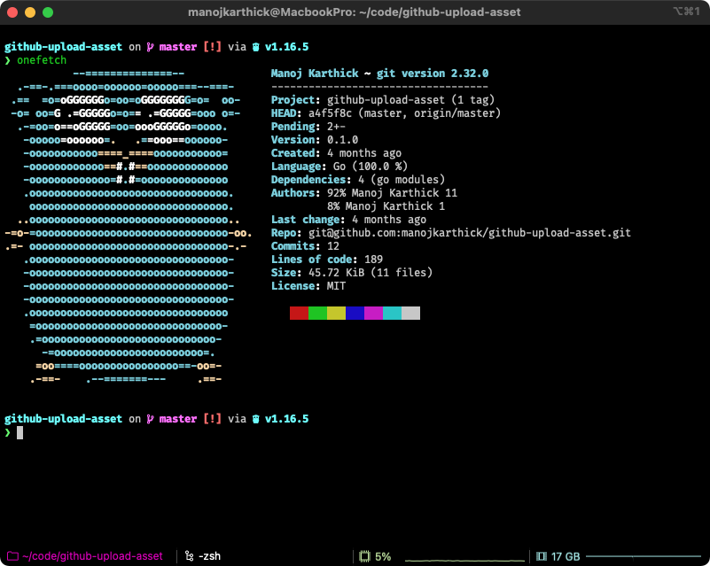

# dotfiles

* This repo contains the configuration and scripts for setting up a macOS machine per my preferences
* Tested to work with macOS Catalina and Big Sur

## Setup

```
git clone https://github.com/manojkarthick/dotfiles.git
make symlinks
```

### Contents

```
├── Makefile               # Contains makefile for updating macports/homebrew and symlinks
├── config                 # Contains configuration files for various programs in the system
│   ├── alacritty          # Configuration for the alacritty terminal emulator: https://github.com/alacritty/alacritty
│   ├── bookmarks          # Contains the list of bookmarked folders
│   ├── conda              # Configuration for miniconda: https://docs.conda.io/en/latest/miniconda.html
│   ├── firefox            # User chrome CSS for firefox: https://www.userchrome.org/
│   ├── gh                 # Configuration for the GitHub CLI tool: https://cli.github.com/
│   ├── git                # Configuration + aliases for git: https://git-scm.com/
│   ├── iTerm2             # iTerm2 Profiles and Keybindings: https://iterm2.com/documentation.html
│   ├── lsd                # @outdated Configuration of lsd (ls deluxe): https://github.com/Peltoche/lsd
│   ├── newsboat           # URLs for the Newsboat RSS reader: https://newsboat.org/
│   ├── nvim               # Contains my Neovim init.vim configuration: https://neovim.io/
│   ├── rectangle          # Keybindings and Profile for Rectangle window manager: https://rectangleapp.com/
│   ├── spectacle          # @deprecated Configuration for Spectacle Window manager
│   ├── starship           # Starship.rs prompt configuration: https://starship.rs/config/
│   ├── timezones          # List of timezones for the tz script to use
│   ├── tmux               # Tmux configuration: https://github.com/tmux/tmux
│   ├── vim                # Contains my vimrc configuration: https://www.vim.org/
│   ├── wget               # Configuration for wget to include some handy details: https://www.gnu.org/software/wget/
│   └── zsh                # Contains my zsh configuration alongside antibody zsh plugins
├── homebrew               # Misc. information about installed Homebrew formulae and casks
├── macports               # Misc. information about requested and installed ports from MacPorts
└── scripts                # Random scripts for bootstrapping, frequent tasks, etc
```

### Screenshots




